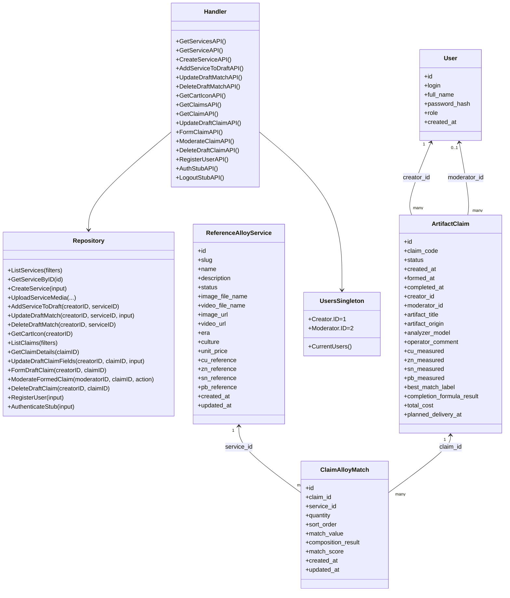

# Lab3: Class Diagram and Backend Detalization

## Domains (URL interfaces)

- `GET /api/services`
- `GET /api/services/:id`
- `POST /api/services`

- `POST /api/claim-items`
- `PUT /api/claim-items/:service_id`
- `DELETE /api/claim-items/:service_id`

- `GET /api/claims/cart-icon`
- `GET /api/claims`
- `GET /api/claims/:id`
- `PUT /api/claims/:id`
- `PUT /api/claims/:id/form`
- `PUT /api/claims/:id/moderate`
- `DELETE /api/claims/:id`

- `POST /api/users/register`
- `POST /api/users/auth`
- `POST /api/users/logout`

## Class Diagram (Mermaid)

## DB Tables

- `users`
- `reference_alloy_services`
- `artifact_claims`
- `claim_alloy_matches`

## Relation Variants in Code

- Methods use different models: service endpoints use `ReferenceAlloyService`, claim endpoints combine `ArtifactClaim` + `ClaimAlloyMatch`.
- Models use other models: `ArtifactClaim` references `User` (creator/moderator), `ClaimAlloyMatch` references both claim and service.
- Models use multiple tables: claim list endpoint joins `artifact_claims`, `users`, and aggregate on `claim_alloy_matches`.
